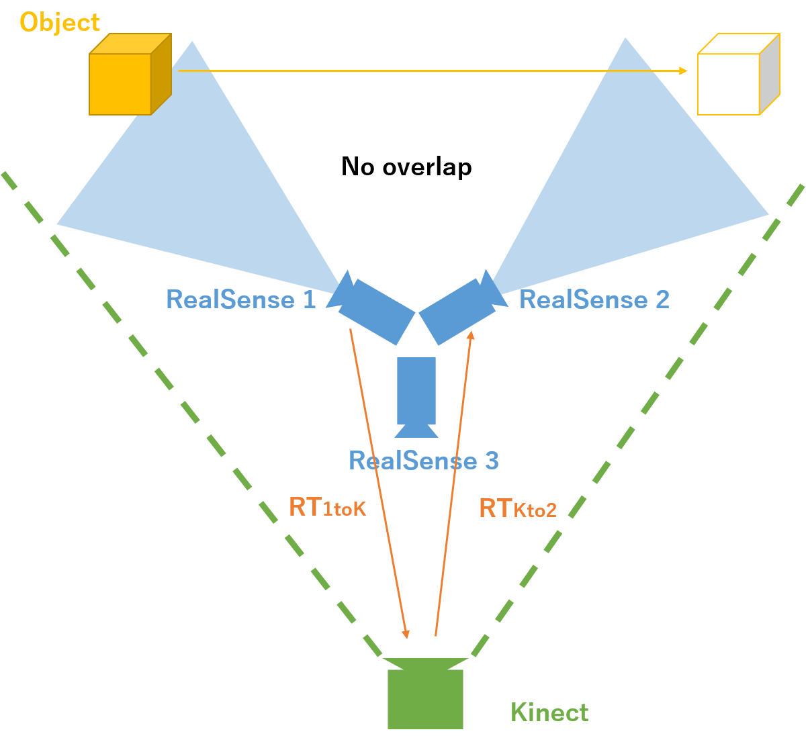
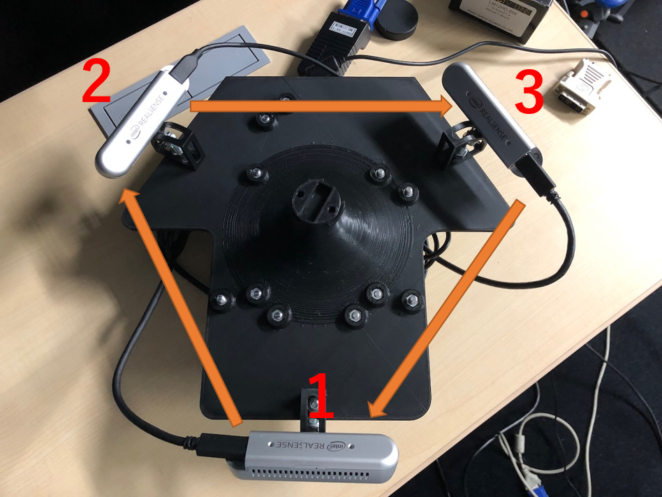

# Omnidirectional-Multi-Camera-Calibration
Calibration method of Omnidirectional Multi-camera whose scene has no overlap.





## Camera setting




## Getting started
Environment : Ubuntu

Requirements
- pyrealsense2
- pyfreenect2
- numpy
- scipy

## Directory
```
root/
  ├ capture/
  ├ calib/
  ├ utils/
  ├ reconst/
  ├ config.py
  |
  └ Captures/
```

| Directory | Description |
|:----------|:------------|
| capture   | Capture codes for RealSense and Kinect. |
| calib     | Caliblation codes. </br>Calcurate each extrinsic parameters between RealSense and Kinect. </br>Calcurate extrinsic parameters of omnidirectional multi-cameras. |
| reconst   | Reconstruct 3D point cloud and accumulate them. |
| utils     | Utility codes. |
| Captures  | Root save folder. |


### capture/
#### Options
capture_realsense.py
- save folder name
- camera number
- capture index (optional)

capture_kinect.py
- save folder name
- camera number
- capture index (optional)

### calib/
Calibration using PLY file by MeshLab.
> - calc_extrinsic.py
> - eval_extrinsic.py
> - edit_ply_realsense.py
> - edit_ply_kinect.py

### utils/
- depth_tools.py
- file_tools.py
- realsense_tools.py

## Tutorial
### Folder
In all capturing and calibration sessions, you shold use same folder name to save.
If you have 3 cameras to calibrate, sub-folder name shold be 'cam12', 'cam23', and 'cam31'.
Example of folder name is '210715'.
```
Captures/
  └ 210715/
      ├ cam12/
      |   ├ realsense/
      |   └ kinect/
      ├ cam23/
      |   ├ realsense/
      |   └ kinect/
      └ cam31/
          ├ realsense/
          └ kinect/
```

### Capture
Change directory to root/capture/.
```
cd capture
```

To calibrate RealSense 1 and 2, capture by RealSense 1 and Kinect, and then, capture by RealSense 2 and Kinect.

Capture the same object by RealSense 1 and Kinect.

Capture by RealSense 1 
```
python capture_realsense.py 210715/cam12 1
```

Capture by Kinect 
```
python capture_kinect.py 210715/cam12 1
```

Then, move the oject in scene of RealSense 2, capture in the same way.
```
python capture_realsense.py 210715/cam12 2
python capture_kinect.py 210715/cam12 2
```

Capture by RealSense 2 and 3, and Kinect.
```
python capture_realsense.py 210715/cam23 2
python capture_kinect.py 210715/cam23 2
python capture_realsense.py 210715/cam23 3
python capture_kinect.py 210715/cam23 3
```

Capture by RealSense 3 and 1, and Kinect.


### Extrinsic Parameters between RealSense and Kinect
Change directory.
```
cd ../calib
```

Since the PLY file of RealSense is saved in metric units and the PLY file of Kinect is saved in millimeters, convert the file of RealSense to millimeters.
```
python edit_ply_realsense.py 210715
```

Load PLY files in MeshLab.
Calcurate RT (Realsense to Kinect).

For example.
Capture/210715/cam12/

```
cam12/
  ├ kinect/
  ├ realsense/
  ├ param_r1-k.txt
  └ param_r2-k.txt
```

Calcurate RT (RealSense 1 to Kinect).
Load kinect/ply_1-0.ply and realsense/ply_1-0_[mm].ply .


### Extrinsic Parameters between RealSense and RealSense

```
python calc_extrinsic.py 210715
```